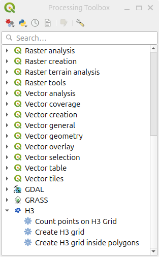

# H3 Toolkit Plugin for QGIS
🌐 Brings the H3 discrete global grid system to [QGIS](https://qgis.org/). 

🚀 Powered by the open source [H3 library](https://h3geo.org/)

## How to Install
- via Plugin Manager in QGIS (Recommended):  
  Look for "[H3 Toolkit](https://plugins.qgis.org/plugins/h3_toolkit/)".

- via `.zip` file:
  1. Download a zipped release. See: [releases](https://github.com/arongergely/qgis-h3-toolkit-plugin/releases)
  2. Proceed to [Install from ZIP](https://docs.qgis.org/3.40/en/docs/user_manual/plugins/plugins.html#the-install-from-zip-tab) in QGIS

### Installing the `h3` dependency
The plugin depends on the `h3` python package, which you would have to install yourself into the Python environment of QGIS. See [H3 Installation](https://h3geo.org/docs/installation)
It is recommended to install the latest version, unless you have specific reasons not to.  
The plugin is tested with `h3` version `4.2.2` but supports all `4.x` and `3.x` versions.

**WARNING: While `h3` is a small package without other Python sub-dependencies, managing dependencies is your responsibility and comes at your own risk. We strive to make it easier, but this does not place any liability on us in case you break your python environment. You are in charge, not the plugin. Be careful and do your due diligence before attempting the below.**

Unfortunately, the process depends on your system and QGIS setup.

#### via a python package manager 
Install using  `pip` (or `conda` if you happen to use a QGIS conda install). 
A basic command to get you started: `pip install h3>=3.0.0`
Note you may need to use `--break-system-packages` as QGIS uses system-wide packages on some systems, e.g., on Ubuntu Linux. 

#### via QPIP 
The [QPIP plugin](https://plugins.qgis.org/plugins/a00_qpip/) is a graphical python dependency manager.
1. Install it alongside  H3 Toolkit.  
2. If it has not prompted you, then reload H3 Toolkit or restart QGIS.
3. Install the dependencies with a click of a button when prompted by QPIP
4. H3 toolkit should load fine now. If not, you may need to reload / restart QGIS one more time.

QPIP is still in early development. It comes with limitations and possibly including bugs. You are encouraged to read up on it on their [GitHub](https://github.com/opengisch/qpip) beforehand.

## How to use
The plugin registers an `H3` processing provider, making the tools available in the Processing Toolbox:



Please have a look at a tool's help text regarding specific usage.

## Suggestions and contributions
Code contributions are welcome and appreciated. If you would like to add a new feature, please post your idea first so we can discuss.

You are also welcome to post suggestions or report issues on the [Issues page](https://github.com/arongergely/qgis-h3-toolkit-plugin/issues). 

## Developer setup
Assuming a Linux development environment:
1. clone this repository
2. Create a symbolic link in the plugin folder within your QGIS profile directory:
   
   To find your profile folder, open QGIS and navigate to *Settings -> User Profiles* and click on *Open Active Profile Folder*. 
   Then the plugin folder should be `<YOUR PROFILE FOLDER>/python/plugins/`

   `cd` into the plugin folder and create a symbolic link to the `h3_toolkit` folder of this repo. 
   ```shell
   ln -s /your/path/to/qgis-h3-toolkit-plugin/h3_toolkit h3_toolkit
   ```

  Example for flatpak installed QGIS:
  ```shell
    # clone repository
    cd ~/dev
    git clone https://github.com/arongergely/qgis-h3-toolkit-plugin.git
    
    # grant user filesystem access to the flatpak
    flatpak override --user --filesystem=home org.qgis.qgis
    
    # make sure to run the clean install once, so it creates the app config directories.
    flatpak run org.qgis.qgis
    
    # ensure the following path exists. Create missing folders when necessary:
    # ~/.var/app/org.qgis.qgis/data/QGIS/QGIS3/profiles/default/python/plugins
    
    # symlink the development directory
    ln -s ~/dev/qgis-h3-toolkit-plugin/h3_toolkit \
      ~/.var/app/org.qgis.qgis/data/QGIS/QGIS3/profiles/default/python/plugins/h3-toolkit

    # install pip for python inside the flatpak
    flatpak run --command=python3 org.qgis.qgis -m ensurepip --upgrade --user

    # now run qgis, open its python console and execute this command:
    !python -m pip install 'h3<4.0'
  ```

#### How to make a release
Simply zip up the `h3_toolkit` directory. The .zip file is then ready for [install from ZIP](https://docs.qgis.org/3.22/en/docs/user_manual/plugins/plugins.html#the-install-from-zip-tab)

There is also a convenience `make` command to generate the .zip file:
```shell
make zip
```
